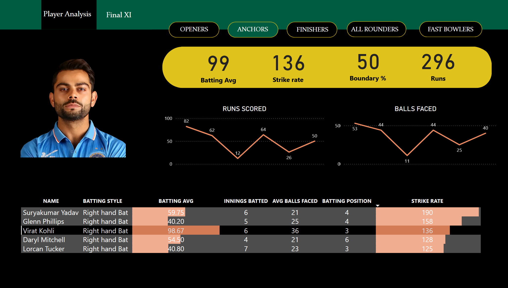

# IPL-Auction-Insights-A-Role-Based-Performance-Dashboard
# -Created a Power BI report to identify top players for a T20 cricket team by scraping data from espncricinfo with a Brightdata tool, cleaning and transforming data with pandas, and evaluating player performance metrics.
# -The resulting dashboard with various categories (openers, middle order/anchors, finishers, all-rounders, specialist
fast bowlers) can be used to create a highly competitive team with a winning percentage of 90%.
